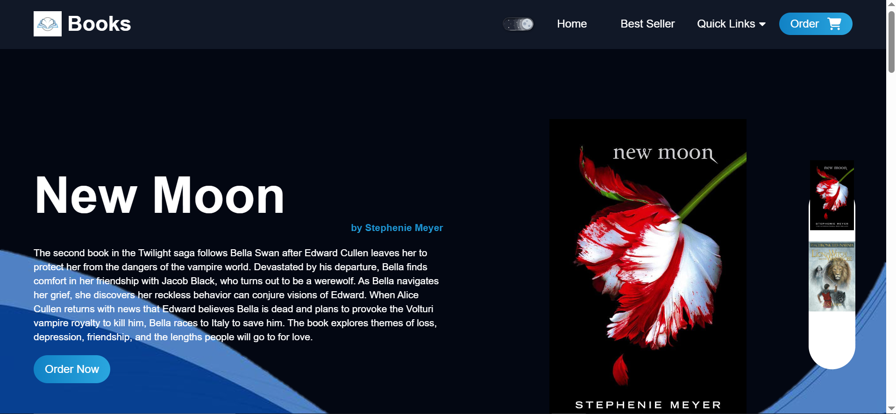

# Online Bookstore - React + Vite

A modern online bookstore built with React, Vite, and Tailwind CSS. Browse books, manage cart, and checkout seamlessly.

 

## Live Demo

👉 [https://online-book-store-reactjs.netlify.app/]

## Technologies

- ⚡ [Vite](https://vitejs.dev/) - Blazing fast build tool.
- ⚛️ [React](https://react.dev/) - Frontend library.
- 🎨 [Tailwind CSS](https://tailwindcss.com/) - Styling.
- 🔄 [React Router](https://reactrouter.com/) - Navigation.

## Getting Started

1. **Clone the repo**:
   ```bash
   git clone https://github.com/rashirajasinghe/online-book-store.git
   cd online-books-tore
